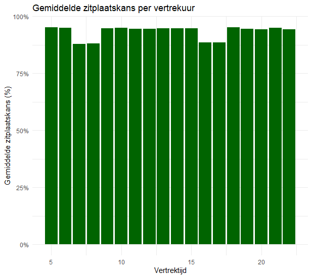

## Managementsamenvatting – Zitplaatskans & Materieelplanning

### Doel
Deze analyse geeft inzicht in de **zitplaatskans voor reizigers** en de mate van **overbezetting** op het spoor, met als doel het verbeteren van de **materieelinzet** en het ondersteunen van data-gedreven planningsbeslissingen.

---

### Disclaimer
De in dit document gebruikte data is door AI gegenereerde dummy data en dient uitsluitend ter illustratie. Eventuele resultaten, analyses en conclusies die hieruit worden afgeleid zijn fictief en mogen niet worden beschouwd als representatief voor de werkelijkheid. Aan de inhoud kunnen geen rechten worden ontleend en de data weerspiegelt geen echte situaties.

---

### Belangrijkste bevindingen

- De **zitplaatskans is structureel lager tijdens de spits**.
- Een beperkt aantal **trajecten en tijdvakken** is verantwoordelijk voor een groot deel van de overbezetting.
- Sommige **materieeltypes** laten consistent hogere bezettingsgraden en een lagere zitplaatskans zien, wat wijst op een mismatch tussen capaciteit en vraag.
- Er zijn duidelijke **seizoenspatronen** zichtbaar, met hogere drukte in specifieke maanden.

---

### Impact
- Reizigers ervaren op drukke trajecten en tijdvakken een **verlaagde kans op een zitplaats**, wat de klanttevredenheid negatief beïnvloedt.
- Overbezetting vergroot de druk op de operatie en bemoeilijkt het structureel behalen van concessie-KPI’s.

---

### Aanbevelingen
1. **Gerichte verlenging in de spits**  
   Zet meer of langer materieel in op de geïdentificeerde knelpunten tijdens ochtend- en avondspits.
2. **Herallocatie van materieel**  
   Verschuif hogere capaciteit naar trajecten met structureel lage zitplaatskans.
3. **Reizigersgewogen sturing**  
   Monitor zitplaatskans primair op **reizigersniveau** in plaats van ritniveau.
4. **Continue KPI-monitoring**  
   Gebruik dashboards om prestaties per traject en tijdvak te volgen en tijdig bij te sturen.

---

### Conclusie
Door **data-gedreven materieelplanning** en focus op de grootste knelpunten kan de zitplaatskans merkbaar worden verbeterd, zonder structurele uitbreiding van de vloot. Dit draagt direct bij aan het realiseren van concessiedoelstellingen en een betere reizigersbeleving.
